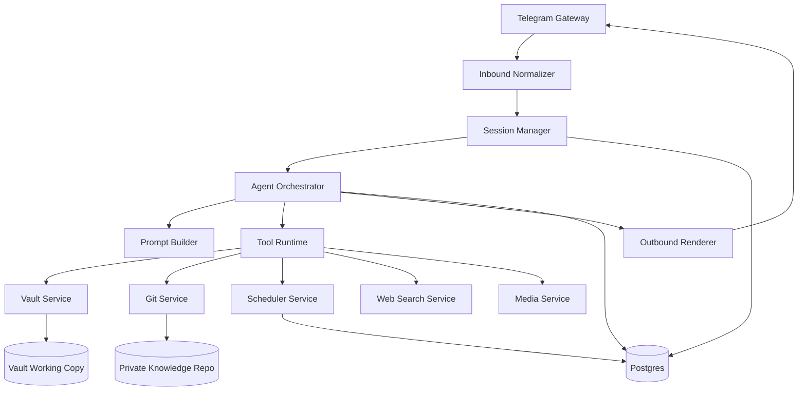

# Architecture

## Purpose

This document is the technical source of truth for the assistant runtime. It describes confirmed architectural decisions, core system design, and open decisions that are intentionally left as `TBD`.

## Confirmed Decisions

- Runtime style: custom orchestrator with a deterministic tool runtime.
- Backend language: Python 3.12+.
- Runtime metadata store: Postgres.
- Knowledge storage: separate Git-backed knowledge-vault repository.
- Primary UX channel: Telegram.
- Workspace model: Telegram topics map to long-lived workspaces.
- Runtime LLM restriction: no arbitrary shell execution.
- File mutations must go through policy-controlled tools and an approval flow.
- Long-term knowledge lives in the vault and Git history, not in raw chat transcripts.
- Initial LLM provider: Z.ai behind an `LLMClient` abstraction.

## System Model

The runtime is application-first:

1. The outside world sends events.
2. The runtime normalizes them into commands.
3. The orchestrator builds context and invokes the LLM.
4. The LLM may call only registered tools with typed contracts.
5. Tool side effects are checked by policy and recorded in audit logs.

## High-Level Components



### Telegram Gateway

- receives inbound updates
- extracts text, links, topic identifiers, and media metadata
- hands off normalized events to the runtime

### Session Manager

- resolves `workspace_id`, `session_id`, and turn boundaries
- stores rolling summaries and active context state
- keeps topic-based workspaces isolated from each other

### Agent Orchestrator

- builds prompts from session state, vault context, and tool results
- invokes the LLM
- validates tool calls and handles the tool loop
- renders the final assistant response

### Tool Runtime

- executes typed tools only
- separates read-only and controlled-write operations
- routes all side effects through policy checks and audit logging

### Policy Layer

- validates allowed paths and file classes
- enforces review-before-commit behavior
- restricts job creation and self-scheduling
- blocks capabilities that are outside the runtime contract

### Persistence Layer

- Postgres stores runtime metadata, sessions, jobs, review requests, and audit events
- the knowledge-vault repository stores user notes, colocated attachments, and assistant-managed artifacts

### Scheduler and Worker

- runs delayed or recurring jobs outside the Telegram request path
- creates job-specific execution sessions
- keeps retries and locks separate from chat handling

## Deployment Topology

### Local First

Single Docker Compose deployment:

- `bot` for Telegram receive/send
- `api` for webhook and admin endpoints
- `worker` for scheduled and background jobs
- `postgres` for runtime data
- `redis` as an optional queue or locking layer
- optional helper service for vault sync or file watching

### Later on a VPS

- the same service split can be preserved
- the vault working copy lives on persistent storage
- backups cover Postgres, the vault working copy, and secrets

## Data Boundaries

### Sources of Truth

- knowledge vault repository for user notes, colocated attachments, agent-owned artifacts, and long-term knowledge
- Postgres for runtime metadata, sessions, jobs, and audit records
- Git history for change tracking and reviewable knowledge mutations

### Not Sources of Truth

- raw LLM transcript history
- Telegram chat history
- ephemeral caches

## Bounded Contexts

### Messaging Context

Responsibilities:

- receive messages and attachments
- extract routing identifiers such as `chat_id`, `message_id`, and `topic_id`
- provide idempotent update processing

Core entities:

- `InboundMessage`
- `Attachment`
- `ChatRoute`
- `TopicRoute`

### Session Context

Responsibilities:

- compute workspace and session keys
- compact old history into summaries
- maintain active workspace state
- isolate concurrent conversation branches

Core entities:

- `Workspace`
- `Session`
- `SessionSnapshot`
- `Turn`

### Knowledge Context

Responsibilities:

- search the vault
- read Markdown notes and colocated attachments
- manage assistant-owned artifacts in the agent vault
- produce reviewable mutation proposals

Core entities:

- `VaultNote`
- `VaultAsset`
- `KnowledgeDraft`
- `VaultIndex`

### Change Management Context

Responsibilities:

- validate proposed file mutations
- build change summaries and review requests
- manage the branch, commit, and pull request lifecycle after approval

Core entities:

- `ChangeSet`
- `ReviewRequest`
- `ApprovalDecision`
- `PullRequestRef`

### Scheduler Context

Responsibilities:

- reminders
- recurring jobs
- follow-up jobs
- isolated job execution

Core entities:

- `ScheduledJob`
- `JobTrigger`
- `JobRun`
- `JobPolicy`

## Session and Workspace Model

### Identity Model

```text
user_id        = logical owner
channel        = telegram
workspace_id   = default | topic:<topic_id> | project:<slug>
session_id     = workspace_id + session epoch
turn_id        = request/response exchange
job_session_id = cron:<job_id>:<run_ts>
```

### Why Workspace Is Not the Same as Session

`Workspace` is a long-lived semantic namespace, for example:

- `topic:career`
- `topic:ai-product`
- `default`

`Session` is a temporary conversational span inside a workspace.

This split allows the system to:

- keep stable workspaces in Telegram
- reset or compact history without losing workspace identity
- maintain separate long-lived summaries per workspace

### Session State Shape

```yaml
session_state:
  workspace_profile:
    name: "analytics"
    default_paths:
      - "User_Obsidian_Vault/Я аналитик"
    allowed_tools:
      - "vault.read"
      - "vault.search"
      - "vault.write"
      - "git.review"
      - "schedule.create"
  rolling_summary: "..."
  active_facts:
    - "User is exploring DS and LLM roles"
  pending_tasks:
    - "Prepare a review summary before the PR"
  open_artifacts:
    - "User_Obsidian_Vault/Я аналитик/Experience/JoomPulse/01. Before First Day.md"
```

### Compaction Strategy

Compaction may happen:

- on token limit
- after inactivity
- on a manual `/compact` command
- before job handoff

Compaction rules:

1. Keep the most recent turns as raw history.
2. Compress older history into `rolling_summary`.
3. Extract durable context into `active_facts`, `open_loops`, and `decisions`.
4. Store summaries in Postgres and promote important outcomes into the vault when appropriate.

## Tool Runtime Design

### Tool Contract

Every tool must define:

- typed input schema
- typed output schema
- explicit side-effect class
- required policy checks
- audit logging hooks

Example:

```python
class VaultWriteTool(Tool):
    name = "vault.write_markdown"
    input_schema = VaultWriteRequest
    output_schema = VaultWriteResult
    side_effect = "filesystem_write"
    required_policies = [
        "path_allowlist",
        "filetype_allowlist",
        "review_flow",
    ]
```

### Tool Categories

Read-only tools:

- `vault.read_note`
- `vault.search`
- `vault.list_directory`
- `git.diff_status`
- `jobs.list`
- `web.search`

Controlled-write tools:

- `vault.create_note`
- `vault.update_note`
- `vault.move_note`
- `vault.create_directory`
- `vault.attach_image`
- `jobs.create`
- `jobs.cancel`
- `git.prepare_review`

Explicitly prohibited in runtime v1:

- arbitrary shell execution
- arbitrary Git commands
- unrestricted HTTP access to unknown hosts
- uncontrolled file deletion

## Knowledge Vault Access

### Repository Expectations

The live knowledge repository is organized as two top-level roots:

- `User_Obsidian_Vault/` for user-owned notes and colocated attachments
- `Agent_Obsidian_Vault/` for assistant-managed artifacts

Common user-vault patterns:

- top-level hub notes such as `User_Obsidian_Vault/Я аналитик.md`
- note-folder pairs such as `User_Obsidian_Vault/Я аналитик.md` with `User_Obsidian_Vault/Я аналитик/`
- note-local attachment folders such as `User_Obsidian_Vault/Я аналитик/Experience/JoomPulse/files/`

These are examples rather than rigid schema contracts. The user vault is intentionally heterogeneous.

### Write Boundaries

Confirmed policy:

- writes are limited to approved roots inside `User_Obsidian_Vault/` and `Agent_Obsidian_Vault/`
- hidden system paths such as `.git/` and `.obsidian/` are not writable from the runtime
- executable files are not valid write targets

Implementation details for canonicalization, symlink handling, and exact staging mechanics remain `TBD`.

### Image Flow

Inbound flow:

```text
Telegram image
  -> file metadata
  -> download bytes
  -> checksum
  -> temporary staging
  -> optional OCR or vision summary
  -> intent resolution
  -> persisted note-local attachment in `files/`
  -> note update
```

Default attachment placement should follow the active note directory, typically `${noteFolderPath}/files`:

```text
User_Obsidian_Vault/<area>/<parent-folder>/files/<generated-name>.<ext>
```

Filename normalization may follow the user's Obsidian attachment configuration rather than a centralized attachment scheme.

The live vault predominantly uses Obsidian wiki links and embeds.

Imported material may still contain standard Markdown links.

New assistant writes should remain compatible with Obsidian link resolution.

## Change Management and Approval Flow

Confirmed behavior:

1. The assistant proposes a change.
2. The runtime validates paths, file classes, and policy constraints.
3. The user receives a reviewable summary.
4. Commit, push, and pull request creation happen only after approval.

Required validations before commit:

- no path escapes outside approved roots
- no protected-path mutations
- no unsupported binary files
- no oversized files outside policy
- review summary generated successfully

The exact pre-approval staging model is `TBD`.

## Scheduler Model

### Why the Worker Is Separate

Scheduled execution must not run inside the Telegram update loop.

Reasons:

- retries need their own execution boundary
- jobs must not block inbound chat handling
- job runs need independent locking and audit trails

### Job Shape

```yaml
job:
  id: uuid
  kind: reminder | recurring_review | reindex | external_poll
  schedule: cron | datetime | interval
  workspace_id: topic:career
  prompt_template: "Remind the user to review ..."
  created_by: user | agent
  enabled: true | false
```

### Job Execution Flow

```text
scheduler trigger
  -> enqueue JobRun
  -> worker acquires lock
  -> worker builds synthetic session context
  -> agent executes in job_session
  -> result is delivered to Telegram and/or stored as an artifact
  -> audit log is recorded
```

Whether job-triggered vault writes are allowed, and whether they always require approval, remains `TBD`.

## Web Search Design

Provider interface:

```python
class WebSearchProvider(Protocol):
    async def search(self, query: str, *, top_k: int = 5) -> list[SearchHit]: ...
```

The provider boundary is confirmed. The concrete provider choice remains `TBD`.

## Observability and Security

### Minimum Audit Coverage

The runtime should log:

- inbound messages
- tool calls
- side effects
- job runs
- vault mutation requests
- review actions
- policy denials

Suggested minimum tables:

- `sessions`
- `turns`
- `tool_calls`
- `jobs`
- `job_runs`
- `vault_mutations`
- `review_requests`
- `audit_events`

### Secrets

Examples:

- Telegram bot token
- Z.ai API key
- Git credentials or deploy key
- optional search provider keys

Secrets must never be stored in the knowledge vault.

Exact redaction and retention boundaries for logs, prompts, OCR output, and note content remain `TBD`.

## Failure Modes

### Telegram Delivery Failure

- retry outbound send
- keep idempotency by outbound request key

### Vault Conflict

- stop the mutation flow
- create a conflict review
- ask the user for a resolution path

### Invalid Tool Call

- reject unknown tool names
- validate all tool payloads against schema
- return structured policy-denial errors

### Duplicate Job Execution

- use a lock keyed by job run identity

### Session Growth

- compact automatically
- persist workspace summaries in Postgres

## TBD / Open Decisions

These items are intentionally unresolved and must not be treated as implementation-ready decisions:

### Mutation and Review Flow

- pre-approval staging model for vault mutations
- whether the runtime uses a separate vault clone or worktree from the user's Obsidian clone
- exact branch naming convention for assistant-generated review branches

### Scheduled Writes

- whether scheduled jobs may write directly to the vault
- whether scheduled writes always require explicit user approval
- whether agent-created follow-up jobs need stricter limits than user-created jobs

### Integrations and Providers

- Telegram bot library choice
- Git integration library choice
- web search provider choice
- LinkedIn API integration design
- Google Calendar API integration design

### Runtime Infrastructure

- whether Redis is optional or required in the MVP
- exact sync strategy for the vault working copy
- deployment-time secret management beyond local development

### Safety and Audit Details

- path canonicalization and symlink-handling rules
- logging redaction boundaries
- retention policy for prompts, OCR output, and audit events

## Suggested ADRs

The following ADRs should be created once the related decisions are locked:

1. `ADR-001-custom-orchestrator.md`
2. `ADR-002-python-backend.md`
3. `ADR-003-postgres-runtime-store.md`
4. `ADR-004-topic-as-workspace.md`
5. `ADR-005-no-shell-runtime.md`
6. `ADR-006-git-approval-flow.md`
