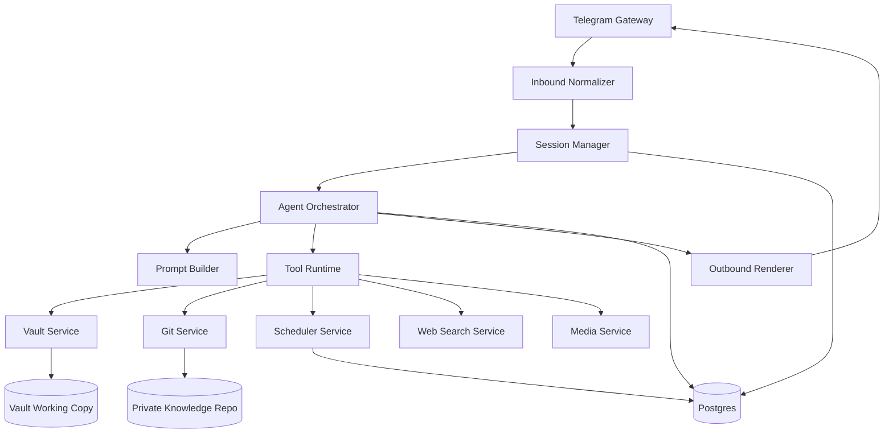

# Architecture

## Purpose

This document is the technical source of truth for the assistant runtime. It describes confirmed architectural decisions, core system design, and open decisions that are intentionally left as `TBD`.

## Confirmed Decisions

- Runtime style: custom orchestrator with a deterministic tool runtime.
- Backend language: Python 3.12+.
- Runtime metadata store: Postgres.
- Knowledge storage: separate Git-backed knowledge-vault repository.
- Primary UX channel: Telegram.
- Workspace model: Telegram topics map to long-lived workspaces.
- Runtime LLM restriction: no arbitrary shell execution.
- File mutations must go through policy-controlled tools and an approval flow.
- Long-term knowledge lives in the vault and Git history, not in raw chat transcripts.
- Initial LLM provider: Z.ai behind an `LLMClient` abstraction.
- Vault mutation review flow uses a service-owned vault clone with isolated per-review worktrees.
- Review branches are created per approved `ReviewRequest`, not per workspace.
- `SessionState` is versioned and typed; `pending_tasks`, `open_loops`, and `decisions` are structured collections.

## System Model

The runtime is application-first:

1. The outside world sends events.
2. The runtime normalizes them into commands.
3. The orchestrator builds context and invokes the LLM.
4. The LLM may call only registered tools with typed contracts.
5. Tool side effects are checked by policy and recorded in audit logs.

## High-Level Components



### Telegram Gateway

- receives inbound updates
- extracts text, links, topic identifiers, and media metadata
- hands off normalized events to the runtime

### Session Manager

- resolves `workspace_id`, `session_id`, and turn boundaries
- stores rolling summaries and active context state
- keeps topic-based workspaces isolated from each other

### Agent Orchestrator

- builds prompts from session state, vault context, and tool results
- invokes the LLM
- validates tool calls and handles the tool loop
- renders the final assistant response

### Tool Runtime

- executes typed tools only
- separates read-only and controlled-write operations
- routes all side effects through policy checks and audit logging

### Policy Layer

- validates allowed paths and file classes
- enforces review-before-commit behavior
- restricts job creation and self-scheduling
- blocks capabilities that are outside the runtime contract

### Persistence Layer

- Postgres stores runtime metadata, sessions, jobs, review requests, and audit events
- the knowledge-vault repository stores user notes, colocated attachments, and assistant-managed artifacts

### Scheduler and Worker

- runs delayed or recurring jobs outside the Telegram request path
- creates job-specific execution sessions
- keeps retries and locks separate from chat handling

## Deployment Topology

### Local First

Single Docker Compose deployment:

- `bot` for Telegram receive/send
- `api` for webhook and admin endpoints
- `worker` for scheduled and background jobs
- `postgres` for runtime data
- `redis` as an optional queue or locking layer
- optional helper service for vault sync or file watching

### Later on a VPS

- the same service split can be preserved
- the vault working copy lives on persistent storage
- backups cover Postgres, the vault working copy, and secrets

## Data Boundaries

### Sources of Truth

- knowledge vault repository for user notes, colocated attachments, agent-owned artifacts, and long-term knowledge
- Postgres for runtime metadata, sessions, jobs, and audit records
- Git history for change tracking and reviewable knowledge mutations

### Not Sources of Truth

- raw LLM transcript history
- Telegram chat history
- ephemeral caches

## Bounded Contexts

### Messaging Context

Responsibilities:

- receive messages and attachments
- extract routing identifiers such as `chat_id`, `message_id`, and `topic_id`
- provide idempotent update processing

Core entities:

- `InboundMessage`
- `Attachment`
- `ChatRoute`
- `TopicRoute`
- `IdempotencyRecord`

Idempotency contract:

```yaml
idempotency_record:
  scope: telegram_inbound | telegram_outbound | job_trigger
  idempotency_key: string
  source_ref: string
  window_expires_at: timestamp
  retained_until: timestamp
  terminal_status: accepted | completed | failed | denied
  result_ref: turn_id | outbound_message_ref | job_run_id
```

Normative keys and windows:

- Telegram inbound uses `tg-in:<bot_id>:<update_id>` when `update_id` is present
- Telegram inbound falls back to `tg-in:<bot_id>:<chat_id>:<topic_id>:<message_id>[:<file_unique_id>]` for attachment-only retries or provider gaps
- Telegram inbound records are deduplicated for `30d`; duplicates must return the previous result without re-running tools
- Telegram outbound uses `tg-out:<route>:<origin_turn_or_job_run>:<message_purpose>` with a `7d` deduplication window
- Telegram outbound metadata remains queryable under `audit_metadata` retention after the deduplication window closes
- Telegram outbound retries must replay the prior delivery result and must not emit a second Telegram message

### Session Context

Responsibilities:

- compute workspace and session keys
- compact old history into summaries
- maintain active workspace state
- isolate concurrent conversation branches

Core entities:

- `Workspace`
- `Session`
- `SessionSnapshot`
- `Turn`

### Knowledge Context

Responsibilities:

- search the vault
- read Markdown notes and colocated attachments
- manage assistant-owned artifacts in the agent vault
- produce reviewable mutation proposals

Core entities:

- `VaultNote`
- `VaultAsset`
- `KnowledgeDraft`
- `VaultIndex`

### Change Management Context

Responsibilities:

- validate proposed file mutations
- build change summaries and review requests
- manage the branch, commit, and pull request lifecycle after approval

Core entities:

- `ChangeSet`
- `ReviewRequest`
- `ApprovalDecision`
- `PullRequestRef`

### Scheduler Context

Responsibilities:

- reminders
- recurring jobs
- follow-up jobs
- isolated job execution

Core entities:

- `ScheduledJob`
- `JobTrigger`
- `JobRun`
- `JobPolicy`

## Session and Workspace Model

### Identity Model

```text
user_id        = logical owner
channel        = telegram
workspace_id   = default | topic:<topic_id> | project:<slug>
session_id     = workspace_id + session epoch
turn_id        = request/response exchange
job_session_id = cron:<job_id>:<run_ts>
```

### Why Workspace Is Not the Same as Session

`Workspace` is a long-lived semantic namespace, for example:

- `topic:career`
- `topic:ai-product`
- `default`

`Session` is a temporary conversational span inside a workspace.

This split allows the system to:

- keep stable workspaces in Telegram
- reset or compact history without losing workspace identity
- maintain separate long-lived summaries per workspace

### Session State Shape

```yaml
session_state:
  schema_version: 1
  workspace_profile:
    workspace_id: "topic:analytics"
    name: "analytics"
    default_paths:
      - "User_Obsidian_Vault/Я аналитик"
    allowed_tools:
      - "vault.read"
      - "vault.search"
      - "vault.write"
      - "git.review"
      - "schedule.create"
  rolling_summary: "..."
  active_facts:
    - "User is exploring DS and LLM roles"
  pending_tasks:
    - id: "task-01"
      title: "Prepare a review summary before the PR"
      status: pending
      owner: assistant
      source_turn_id: "turn-42"
      blocking_on: approval
      related_artifacts:
        - "User_Obsidian_Vault/Я аналитик/Experience/JoomPulse/01. Before First Day.md"
  open_loops:
    - id: "loop-01"
      kind: approval
      summary: "Wait for approval on the prepared review request"
      waiting_on: user
      source_turn_id: "turn-42"
      opened_at: "2026-03-10T12:00:00Z"
      related_task_ids:
        - "task-01"
  decisions:
    - id: "decision-01"
      topic: "review-flow"
      summary: "Create one review branch per approved review request"
      decided_by: user
      source_turn_id: "turn-21"
      decided_at: "2026-03-09T18:40:00Z"
  open_artifacts:
    - "User_Obsidian_Vault/Я аналитик/Experience/JoomPulse/01. Before First Day.md"
  last_compacted_at: "2026-03-10T12:05:00Z"
```

Normative collection rules:

- `schema_version` is mandatory and must be incremented on incompatible shape changes.
- `pending_tasks` contains only unresolved actionable items with `status in {pending, in_progress, blocked}`.
- terminal tasks such as `done`, `cancelled`, or `dropped` must leave `session_state` and remain only in audit history or summaries.
- `open_loops` contains only unresolved follow-ups with `kind in {user_answer, approval, conflict, external_event}`.
- `decisions` contains only active finalized decisions that still affect behavior; superseded or historical decisions must leave `session_state` and remain only in durable history.
- free-form string-only variants of `pending_tasks`, `open_loops`, and `decisions` are invalid.

### Compaction Strategy

Compaction may happen:

- on token limit
- after inactivity
- on a manual `/compact` command
- before job handoff

Compaction rules:

1. Keep the most recent turns as raw history.
2. Compress older history into `rolling_summary`.
3. Extract durable context into `active_facts`, `pending_tasks`, `open_loops`, and `decisions`.
4. Store summaries in Postgres and promote important outcomes into the vault when appropriate.
5. Drop terminal tasks and superseded decisions from the compacted `session_state`.

## Tool Runtime Design

### Tool Contract

Every tool must define:

- typed input schema
- typed output schema
- explicit side-effect class
- required policy checks
- audit logging hooks

Example:

```python
class VaultWriteTool(Tool):
    name = "vault.write_markdown"
    input_schema = VaultWriteRequest
    output_schema = VaultWriteResult
    side_effect = "filesystem_write"
    required_policies = [
        "path_allowlist",
        "filetype_allowlist",
        "review_flow",
    ]
```

### Tool Categories

Read-only tools:

- `vault.read_note`
- `vault.search`
- `vault.list_directory`
- `git.diff_status`
- `jobs.list`
- `web.search`

Controlled-write tools:

- `vault.create_note`
- `vault.update_note`
- `vault.move_note`
- `vault.create_directory`
- `vault.attach_image`
- `jobs.create`
- `jobs.cancel`
- `git.prepare_review`

Explicitly prohibited in runtime v1:

- arbitrary shell execution
- arbitrary Git commands
- unrestricted HTTP access to unknown hosts
- uncontrolled file deletion

## Knowledge Vault Access

### Repository Expectations

The live knowledge repository is organized as two top-level roots:

- `User_Obsidian_Vault/` for user-owned notes and colocated attachments
- `Agent_Obsidian_Vault/` for assistant-managed artifacts

Common user-vault patterns:

- top-level hub notes such as `User_Obsidian_Vault/Я аналитик.md`
- note-folder pairs such as `User_Obsidian_Vault/Я аналитик.md` with `User_Obsidian_Vault/Я аналитик/`
- note-local attachment folders such as `User_Obsidian_Vault/Я аналитик/Experience/JoomPulse/files/`

These are examples rather than rigid schema contracts. The user vault is intentionally heterogeneous.

### Write Boundaries

Confirmed policy:

- writes are limited to approved roots inside `User_Obsidian_Vault/` and `Agent_Obsidian_Vault/`
- hidden system paths such as `.git/` and `.obsidian/` are not writable from the runtime
- executable files are not valid write targets

Write-policy contract:

```yaml
write_policy_decision:
  requested_path: string
  canonical_path: string
  effective_path: string
  policy_decision: allow | deny | remap
  fallback_reason: null | outside_write_root | obsidian_attachment_escape
```

Normative path validation:

1. Resolve every candidate write path relative to the vault working copy before any file mutation.
2. Canonicalize the candidate path and reject any path containing `..` traversal after normalization.
3. Reject targets under protected paths such as `.git/`, `.obsidian/`, hidden runtime metadata directories, and executable file targets.
4. Deny the write if the target path itself or any ancestor in the resolved path is a symlink, even when the final resolved location still lands inside the vault repository.
5. Allow the write only when the canonical path stays inside an approved write root under `User_Obsidian_Vault/` or `Agent_Obsidian_Vault/`.

`requested_path`, `canonical_path`, and `effective_path` must be recorded in review artifacts and audit records for every controlled write.

### Image Flow

Inbound flow:

```text
Telegram image
  -> file metadata
  -> download bytes
  -> checksum
  -> temporary staging
  -> optional OCR or vision summary
  -> intent resolution
  -> persisted note-local attachment in `files/`
  -> note update
```

Default attachment placement should follow the active note directory, typically `${noteFolderPath}/files`:

```text
User_Obsidian_Vault/<area>/<parent-folder>/files/<generated-name>.<ext>
```

Filename normalization may follow the user's Obsidian attachment configuration rather than a centralized attachment scheme.

If Obsidian attachment configuration resolves outside approved write roots, the runtime must ignore that external target, remap the asset into the nearest allowed note-local `files/` directory, and record `policy_decision=remap` with `fallback_reason=obsidian_attachment_escape`.

Attachment path handling must follow the same canonicalization and symlink-denial rules as other controlled writes.

Review summaries must surface attachment remaps so the user can see both the requested and effective paths before approval.

The live vault predominantly uses Obsidian wiki links and embeds.

Imported material may still contain standard Markdown links.

New assistant writes should remain compatible with Obsidian link resolution.

## Change Management and Approval Flow

Confirmed behavior:

1. The assistant proposes a change.
2. The runtime validates paths, file classes, and policy constraints.
3. The user receives a reviewable summary.
4. Commit, push, and pull request creation happen only after approval.

Required validations before commit:

- no path escapes outside approved roots
- no protected-path mutations
- no unsupported binary files
- no oversized files outside policy
- review summary generated successfully

Approval modes:

- interactive requests and any mutation targeting `User_Obsidian_Vault/` require explicit per-change review approval
- scheduled jobs may use approval granted at job creation or update only for direct artifact writes that stay inside declared `Agent_Obsidian_Vault/` prefixes
- a scheduled run that proposes a `User_Obsidian_Vault/` change must emit a review package and wait for explicit approval before the mutation pipeline continues

Confirmed staging model:

- the runtime maintains one service-owned vault clone per environment and never writes into the user's live Obsidian clone
- each review request creates an isolated local staging branch `assistant/staging/<review_request_id>` and a dedicated worktree rooted at a recorded `base_commit`
- pre-approval file mutations happen only inside that staging worktree
- every prepared review persists both the filesystem staging metadata and a normalized `change_manifest` so the worktree can be replayed or rebuilt deterministically

Review request contract:

```yaml
review_request:
  id: "rr_01HV6M8F8MQ8Q0QFQ5Y5B4Y8CN"
  base_branch: "main"
  base_commit: "abc1234"
  staging_branch: "assistant/staging/rr_01HV6M8F8MQ8Q0QFQ5Y5B4Y8CN"
  staging_worktree_path: "/srv/personal-assistant/vault/worktrees/rr_01HV6M8F8MQ8Q0QFQ5Y5B4Y8CN"
  change_manifest:
    - op: "update_file"
      path: "User_Obsidian_Vault/Я аналитик/Experience/JoomPulse/01. Before First Day.md"
      content_sha256: "..."
  branch_name: "assistant/review/analytics/rr_01hv6m8f8mq8q0qfq5y5b4y8cn-note-rewrite"
  commit_sha: null
  pr_ref: null
  status: "awaiting_approval"
  last_error: null
  superseded_by: null
  created_at: "2026-03-10T12:00:00Z"
  approved_at: null
```

Lifecycle:

1. `git.prepare_review` fetches `origin/<base_branch>`, records `base_commit`, creates the staging branch and worktree, applies the requested mutations, and stores review metadata plus `change_manifest`.
2. The user reviews the diff and summary from the isolated worktree. No `push`, remote branch, or PR exists before approval.
3. On approval, the runtime replays the same `change_manifest` on top of the latest `origin/<base_branch>` in a fresh worktree.
4. If replay conflicts or changes the reviewed diff, the review request becomes `conflicted` and must be regenerated instead of silently rebased.
5. If replay is clean, the runtime commits the changes, pushes the final review branch, and creates the PR.

State machine:

```text
drafting
  -> awaiting_approval
  -> approved_pending_replay
  -> commit_created
  -> branch_pushed
  -> pr_created
```

Recoverable and terminal side states:

- `failed_recoverable` for retryable infrastructure failures such as `commit ok -> push failed`
- `conflicted` when replay on the latest base is not clean or changes the reviewed diff
- `superseded` when a newer review request replaces the current one
- `abandoned` when an unapproved review request expires past the cleanup window

Recovery rules:

- if `commit_sha` exists and `push` fails, retry only the push step
- if the remote branch already exists and PR creation fails, retry only PR creation against the recorded `branch_name`
- if the staging worktree is lost or stale, rebuild it from `change_manifest` plus `base_commit` rather than treating the filesystem as the only source of truth

Branch naming and cleanup:

- final pushed review branches use `assistant/review/<workspace_slug>/<review_request_id>-<theme_slug>`
- `workspace_slug` and `theme_slug` must be lowercase Git-safe ASCII; non-Latin names should be transliterated, and empty or unstable slugs must fall back to `<kind>-<hash8>`
- if a user-supplied ticket exists, include it in `theme_slug` such as `jpa-123-note-rewrite`, but do not make a ticket mandatory
- local staging branches and worktrees must be deleted immediately after terminal states
- remote review branches should be deleted after PR merge or close, and superseded or abandoned branches should be swept after `14d`

## Scheduler Model

### Why the Worker Is Separate

Scheduled execution must not run inside the Telegram update loop.

Reasons:

- retries need their own execution boundary
- jobs must not block inbound chat handling
- job runs need independent locking and audit trails

### Job Shape

```yaml
job:
  id: uuid
  kind: reminder | recurring_review | reindex | external_poll
  schedule: cron | datetime | interval
  workspace_id: topic:career
  prompt_template: "Remind the user to review ..."
  created_by: user | agent
  activation_state: pending_approval | active | paused | expired
  allowed_write_prefixes:
    - "Agent_Obsidian_Vault/tasks/daily-review"
  artifact_root: "Agent_Obsidian_Vault/tasks/daily-review"
  approval_mode: on_create | per_change_set
  max_runs: 30 | null
  expires_at: timestamp | null
  allow_self_reschedule_within_bounds: true | false
```

```yaml
job_policy:
  allow_direct_agent_artifact_write: true | false
  allow_direct_user_vault_write: false
  allow_child_jobs: false
  min_interval: duration
```

### Job Execution Flow

```text
scheduler trigger
  -> enqueue JobRun
  -> worker acquires lock
  -> worker builds synthetic session context
  -> agent executes in job_session
  -> result is delivered to Telegram and/or stored as an artifact
  -> audit log is recorded
```

Job-trigger idempotency:

- scheduled execution uses `job-run:<job_id>:<scheduled_at>` as the persistent idempotency key
- job-trigger records are retained for `365d`
- duplicate triggers must reuse the existing `job_run_id`, replay the stored terminal status, and must not create a second execution

Scheduled write policy:

- scheduled jobs may directly persist only to declared `Agent_Obsidian_Vault/` prefixes approved at job creation or update
- scheduled runs must not directly mutate `User_Obsidian_Vault/`; they may only produce a review package for those changes and wait for explicit approval
- `user-created` jobs do not require per-run approval when a run stays inside its approved `Agent_Obsidian_Vault/` scope and artifact type
- `agent-created` follow-up jobs default to `pending_approval` and become `active` only after explicit user approval

Stored artifact locations:

- normal job outputs live under `Agent_Obsidian_Vault/tasks/<job_slug>/runs/YYYY/MM/DD/<run_ts>--<job_id>.md`
- review packages for job-proposed `User_Obsidian_Vault/` mutations live under `Agent_Obsidian_Vault/reviews/<job_id>/<run_ts>.md`

Agent-created follow-up defaults after approval:

- `allowed_write_prefixes` remain limited to approved agent-owned paths
- `approval_mode` remains `on_create` for agent-vault artifact writes and `per_change_set` for proposed user-vault mutations
- `min_interval` defaults to `6h`
- `max_runs` defaults to `30`
- `expires_at` must be no more than `30d` after approval
- `allow_child_jobs` remains `false`
- self-rescheduling is allowed only for the same job and only without widening write scope, cadence, `max_runs`, or `expires_at`

```yaml
job_run_result:
  artifact_paths:
    - string
  review_request_id: uuid | null
  policy_decision: allow | deny | review_required
```

Every auto-written artifact must emit audit data containing `job_id`, `job_run_id`, `approval_mode`, `artifact_paths`, and `policy_decision`.

## Web Search Design

Provider interface:

```python
class WebSearchProvider(Protocol):
    async def search(self, query: str, *, top_k: int = 5) -> list[SearchHit]: ...
```

The provider boundary is confirmed. The concrete provider choice remains `TBD`.

## Observability and Security

### Minimum Audit Coverage

The runtime should log:

- inbound messages
- tool calls
- side effects
- job runs
- vault mutation requests
- review actions
- policy denials

Suggested minimum tables:

- `sessions`
- `turns`
- `tool_calls`
- `jobs`
- `job_runs`
- `vault_mutations`
- `review_requests`
- `audit_events`

Audit visibility contract:

```yaml
audit_payload:
  log_visibility: system_redacted | operator_raw
  retention_class: success_raw | failed_job_raw | denied_write_raw | audit_metadata
```

Logging model:

- `system/application logs` must stay structured and redacted
- `operator debug/audit` may include raw prompts, OCR text, and note excerpts under the selected `Debug-first` posture
- secrets, access tokens, auth headers, Git credentials, and raw binary attachment bytes are forbidden in both sinks

Retention policy:

| retention_class | Content | Retention |
| --- | --- | --- |
| `success_raw` | Raw prompts, OCR text, and note excerpts for successful requests | `7d` |
| `failed_job_raw` | Raw prompts, OCR text, and note excerpts for failed jobs | `14d` |
| `denied_write_raw` | Raw prompts, OCR text, and note excerpts for denied write attempts | `30d` |
| `audit_metadata` | Structured audit events, review decisions, delivery metadata, and idempotency records | `365d` |

Retention enforcement:

- retention sweeps must purge expired raw payloads by class while keeping surviving metadata references valid
- `audit_metadata` must remain queryable after raw payload purge
- operator-visible access to `operator_raw` data must be narrower than general application log access

### Secrets

Examples:

- Telegram bot token
- Z.ai API key
- Git credentials or deploy key
- optional search provider keys

Secrets must never be stored in the knowledge vault.

## Failure Modes

### Telegram Delivery Failure

- retry outbound send
- keep idempotency by outbound request key
- return the previously stored delivery result when the same outbound key is replayed

### Vault Conflict

- stop the mutation flow
- create a conflict review
- ask the user for a resolution path

### Invalid Tool Call

- reject unknown tool names
- validate all tool payloads against schema
- return structured policy-denial errors

### Duplicate Job Execution

- use a lock keyed by job run identity
- reuse the existing `job_run_id` when the same `job-run:<job_id>:<scheduled_at>` key is observed again

### Session Growth

- compact automatically
- persist workspace summaries in Postgres

## TBD / Open Decisions

These items are intentionally unresolved and must not be treated as implementation-ready decisions:

Resolved TBD numbers are intentionally omitted below so references stay stable across revisions.

### Integrations and Providers

- `TBD-08` Telegram bot library choice
- `TBD-09` Git integration library choice
- `TBD-10` web search provider choice
- `TBD-11` LinkedIn API integration design
- `TBD-12` Google Calendar API integration design

### Runtime Infrastructure

- `TBD-13` whether Redis is optional or required in the MVP
  Comment: document which queue, locking, and retry guarantees degrade or disappear when Redis is not present.
- `TBD-14` exact sync strategy for the vault working copy
  Comment: review-flow fetch and replay behavior is fixed above; broader background sync cadence and non-review conflict handling remain open.
- `TBD-15` deployment-time secret management beyond local development

## ADR References

The following ADRs capture implemented decisions or reserve slots for decisions that should be written down once they are locked:

1. `ADR-001-custom-orchestrator.md`
2. `ADR-002-python-backend.md`
3. `ADR-003-postgres-runtime-store.md`
4. `ADR-004-topic-as-workspace.md`
5. `ADR-005-no-shell-runtime.md`
6. `ADR-006-git-approval-flow.md`
7. `ADR-007-scheduled-write-policy.md`
8. `ADR-008-session-state-schema.md`
